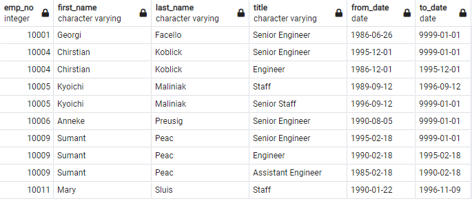
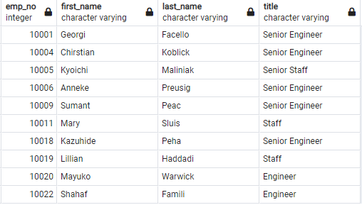
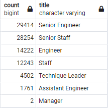
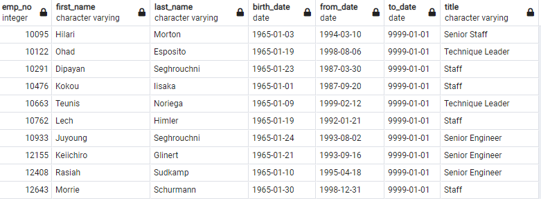
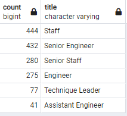

# Overview of Project:
 
As many employees were about to reach retirement age, we have been tasked by Pewlett-Hackard to help prevent an upcoming 'Silver Tsunami' and defined which employees could integrate a mentorship program.  
As now, the company database could not provide the desired insights. 
We helped the company re-organized it to discover trends to answer our problematic. 
- We determined the number of retiring employees based on their title.
- We identified employees about to retire, eligible for a mentorship program. 

 
# Results:

This analysis gave us insights on four major points: 

- We determined from the database whose employees born between 1952 and 1955 and about to reach retirement age. 

- We learned that there were duplicate employees who switch title during their time in the company, then we filtered the previous table to get their latest job title. 

- We established the number of employees about to retire per department based on their latest job title. 

- We could then get employees who were still currently working in the company and based on their birth-date (between January-01-1965 and December-31-1965), we determined if they could be part of a mentorship program. 

# Summary:

After re-organizing the department database based on employees reaching the retirement age, we analysed:

- The company will be needed 90,396 new roles due to numbers of retirement all department included.
- There were 1,549 employees eligible for a mentorship program. 
 
Based on this analysis, we established that there is not enough retirement-ready employees to mentor the next generation, based on the number of employees about to leave their function. 
More particularly for the technique-leader and assistant-engineer departments. And most important there was none for the manager departments.

We could get more insights about the upcoming 'Silver-Tsunami' creating other tables:

- Filtering the database based on the employees age to get more prevision on the upcoming retirement wave and not just about whose who already reached it and in fact be able to hire new employee in needed departments.
- Built an other query to determine employees who are not reaching the retirement age, but who have been in the company at a senior level long enough to integrate the mentorship program. 

